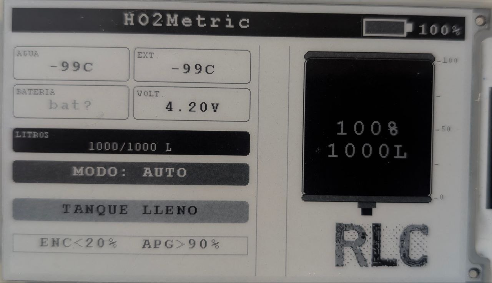

# HO2Metric

Monitor de tanque de agua con control automático de bomba, pantalla e-ink de 4 grises y sistema de alertas. Desarrollado para **Raspberry Pi Pico o pico 2 (RP2040 o RP2350)** con **TinyGo**.



---

## Tabla de contenidos

* [Características](#características)
* [Hardware requerido](#hardware-requerido)
* [Distribución de pines](#distribución-de-pines)
* [Diagrama de la interfaz](#diagrama-de-la-interfaz)
* [Estructura del proyecto](#estructura-del-proyecto)
* [Requisitos de software](#requisitos-de-software)
* [Compilar y flashear](#compilar-y-flashear)
* [Calibración del sensor de nivel](#calibración-del-sensor-de-nivel)
* [Umbrales y configuración](#umbrales-y-configuración)
* [Estados del sistema](#estados-del-sistema)
* [Notas de hardware](#notas-de-hardware)
* [Licencia](#licencia)

---

## Características

* Pantalla e-ink Waveshare Pico-ePaper-3.7 (280×480 px, 4 grises, controlador SSD1677)
* Sensor de nivel sumergible 4–20 mA, rango 1 metro, alimentación 5 V
* Dos sensores de temperatura DS18B20 (agua y exterior) por protocolo 1-Wire
* Módulo UPS Waveshare UPS Module B con chip MAX17048 (% batería, voltaje, estado de carga)
* Control de dos relés para bomba de agua
* Modo automático (histéresis 20 % / 90 %) y modo manual
* Sistema de alertas con wake-up por interrupción de botón
* Sleep limpio de pantalla antes de deep sleep (recomendación SSD1677)
* Doble núcleo: Core 0 maneja pantalla y lógica, Core 1 lee sensores continuamente

---

## Hardware requerido

| Componente | Modelo / Especificación |
|---|---|
| Microcontrolador | Raspberry Pi Pico o pico 2 (RP2040 o RP2350) |
| Pantalla | Waveshare Pico-ePaper-3.7 |
| Sensor de nivel | Sumergible 0–3.3v, 1 m, 5 V + resistencia shunt 120 Ω |
| Sensor temperatura agua | DS18B20 waterproof + resistencia pull-up 4.7 kΩ |
| Sensor temperatura exterior | DS18B20 TO-92 + resistencia pull-up 4.7 kΩ |
| Módulo batería | Waveshare UPS Module B (MAX17048) |
| Relés | 2× módulo relé activo en LOW (o HIGH, configurable) |
| Botones | 2× pulsador normalmente abierto, conexión a GND |

---

## Distribución de pines

### Pantalla e-ink — SPI1

| GPIO | Pin físico | Función | Descripción |
|---|---|---|---|
| GP8  | 11 | DC   | Data / Command |
| GP9  | 12 | CS   | Chip Select |
| GP10 | 14 | SCK  | Clock SPI |
| GP11 | 15 | MOSI | Datos hacia pantalla |
| GP12 | 16 | RST  | Reset hardware |
| GP13 | 17 | BUSY | Señal de ocupado |
| GP28 | 34 | MISO | No usado en escritura |

> La pantalla se conecta directamente al header del Pico mediante el módulo Waveshare Pico-ePaper-3.7, que encaja sobre los pines del Pico sin cables adicionales.

---

### Sensores — Core 1

| GPIO | Pin físico | Función | Componente | Notas |
|---|---|---|---|---|
| GP4  | 6  | 1-Wire | DS18B20 temperatura agua | Pull-up 4.7 kΩ a 3.3 V |
| GP5  | 7  | 1-Wire | DS18B20 temperatura exterior | Pull-up 4.7 kΩ a 3.3 V |
| GP6  | 9  | I2C1 SDA | MAX17048 UPS-B | Pull-up integrado en módulo |
| GP7  | 10 | I2C1 SCL | MAX17048 UPS-B | Pull-up integrado en módulo |
| GP26 | 31 | ADC0 | Sensor nivel 4–20 mA | Shunt 120 Ω a GND |

**Circuito del sensor de nivel 4–20 mA:**

```
Sensor +  →  VCC (5 V)
Sensor −  →  GP26  →  Resistencia 120 Ω  →  GND
```

El ADC del Pico lee el voltaje sobre la resistencia (0.48 V vacío / 2.40 V lleno).

---

### Control — Core 0

| GPIO | Pin físico | Función | Descripción |
|---|---|---|---|
| GP16 | 21 | Relé 1 | Control bomba fase |
| GP17 | 22 | Relé 2 | Control bomba neutro |
| GP18 | 24 | Botón MODO | Alternar AUTO / MANUAL (pull-up interno) |
| GP19 | 25 | Botón BOMBA | Encender/apagar bomba en MANUAL + wake-up |
| LED  | —  | LED interno | Indicador de estado en arranque |

**Conexión de botones:**

```
GP18 / GP19  →  Botón  →  GND
```

Sin resistencias externas: se usa el pull-up interno del RP2040.

**Lógica de relés** ( `ReleActivoHigh = false` por defecto):
* Relé activo en LOW: el módulo conduce cuando el pin está en GND
* Para módulos activos en HIGH cambiar la constante a `true` en `main.go`

---

## Diagrama de la interfaz

La pantalla opera en modo landscape (480×280 px, rotación 90°):

```
┌─────────────────────────────────────────────────────────────────┐
│  HO2Metric                               [████░░] 23%           │   │  ← Cabecera (26 px)                                             │
├─────────────────────────────┬───┬───────────────────────────────│
│  AGUA         EXT.          │   │   ┌──────────┐                │
│  [  22°C  ]  [  30°C  ]     │   │   │  ~~~~~~  │  100           │
│                             │   │   │          │                │
│  BATERÍA      VOLT.         │   │   │  ██████  │   50           │
│  [ -desc  ]  [ 4.20V ]      │   │   │  ██████  │                │
│                             │   │   │  ██████  │    0           │
│  ┌──────────────────────┐   │   │   │  50%     │                │
│  │  LITROS: 500/1000 L  │   │   │   │  500 L   │                │
│  └──────────────────────┘   │   │   │          │                │
│                             │   │   └──────────┘                │
│  ┌──────────────────────┐   │   │      [logo]                   │
│  │    MODO: AUTO        │   │   │                               │
│  └──────────────────────┘   │   │                               │
│  ┌──────────────────────┐   │   │                               │
│  │    BOMBA: OFF        │   │   │                               │
│  └──────────────────────┘   │   │                               │
│  ┌──────────────────────┐   │   │                               │
│  │ ENC<20%    APG>90%   │   │   │                               │
│  └──────────────────────┘   │   │                               │
└─────────────────────────────┴───┴───────────────────────────────┘
        Panel datos (col. 0–260)   ↑    Panel tanque (col. 292–480)
                              separadores
```

**Colores disponibles (4 grises SSD1677):**

| Constante | Valor | Uso |
|---|---|---|
| `ColorBlack` | 0x00 | Cabecera, texto principal, tanque lleno |
| `ColorDarkGray` | 0x02 | Bordes de cards, relleno medio del tanque |
| `ColorLightGray` | 0x01 | Textos secundarios, tanque nivel bajo |
| `ColorWhite` | 0x03 | Fondo general, textos sobre negro |

---

## Estructura del proyecto

```
ho2metric/
├── main.go                  # Loop principal, botones, lógica de relés
├── epd_driver.go            # Driver SSD1677: init, SPI, rotación, deep sleep
├── epd_graphics.go          # Primitivas gráficas: líneas, rectángulos, texto, imágenes
├── fonts.go                 # Tablas de fuentes bitmap (Font8, Font12, Font16, Font20, Font24)
├── images.go                # Imágenes bitmap embebidas (logo RLC, etc.)
├── sensores.go              # Core 1: ADC nivel, DS18B20, MAX17048 I2C
├── funciones_Expeciales.go  # Widgets de pantalla: header, tanque, datos, batería
└── power_states.go          # Máquina de estados: ACTIVO / SLEEP / ALERTA
```

---

## Requisitos de software

* [TinyGo](https://tinygo.org/) v0.31 o superior
* Go 1.21 o superior (requerido por TinyGo)
* `tinygo` en el PATH del sistema

**Instalar TinyGo en Linux/macOS:**

```bash
# Con snap (Linux)
sudo snap install tinygo --classic

# Con Homebrew (macOS)
brew tap tinygo-org/tools
brew install tinygo

# Verificar instalación
tinygo version
```

**Instalar TinyGo en Windows:**

Descargar el instalador desde https://github.com/tinygo-org/tinygo/releases y agregar la carpeta `bin` al PATH del sistema.

---

## Compilar y flashear

### Raspberry Pi Pico (RP2040) — método UF2 (recomendado)

Mantener presionado el botón **BOOTSEL** del Pico mientras se conecta el USB. Aparece como unidad de almacenamiento `RPI-RP2` .

```bash
# Compilar y flashear directamente
tinygo flash -target=pico .

# Solo compilar (genera el .uf2)
tinygo build -target=pico -o ho2metric.uf2 .

# Copiar manualmente el .uf2 a la unidad RPI-RP2
cp ho2metric.uf2 /media/$USER/RPI-RP2/
```

### Raspberry Pi Pico W (RP2040 + WiFi)

El Pico W usa un target diferente porque el LED interno está conectado al chip WiFi:

```bash
tinygo flash -target=pico-w .
```

> En el Pico W el `machine.LED` apunta al pin correcto del chip CYW43. El resto del código es idéntico.

### Raspberry Pi Pico 2 (RP2350)

El Pico 2 usa el chip RP2350 (Cortex-M33 + RISC-V). TinyGo lo soporta desde v0.32:

```bash
tinygo flash -target=pico2 .
```

> Verificar la versión de TinyGo instalada: `tinygo version` . Si es anterior a 0.32 el target `pico2` no estará disponible.

### Ver salida serial (monitor)

```bash
# Linux / macOS
tinygo monitor -target=pico

# O con cualquier terminal serie a 115200 baud
# Linux:
screen /dev/ttyACM0 115200

# macOS:
screen /dev/cu.usbmodem* 115200

# Windows (PowerShell con PuTTY o similar):
# Puerto: COMx — velocidad: 115200
```

### Limpiar caché de compilación

```bash
tinygo clean
```

---

## Calibración del sensor de nivel

Los valores de ADC teóricos son un punto de partida. Para calibración exacta:

1. Flashear el firmware y abrir el monitor serial
2. Conectar el sensor con el shunt de 120 Ω en GP26
3. Con el **tanque vacío**, leer el valor impreso y actualizar:
   

```go
   // sensores.go
   adcNivelVacio = XXXX  // valor real medido
   ```

4. Llenar el **tanque completamente**, leer y actualizar:
   

```go
   adcNivelLleno = XXXX  // valor real medido
   ```

5. Flashear nuevamente con los valores calibrados

Para imprimir el valor crudo del ADC temporalmente en `sensores.go` :

```go
func leerNivel4_20mA(adc machine.ADC) int {
    // ... (código existente de suma)
    raw := int(suma / 16)
    fmt.Println("ADC raw:", raw)  // ← agregar esta línea para calibrar
    // ... resto
}
```

---

## Umbrales y configuración

Todos los umbrales se encuentran en `main.go` y `power_states.go` :

```go
// main.go — Control de bomba
UmbralEncendido = 20   // % — AUTO: enciende bomba por debajo de este valor
UmbralApagado   = 90   // % — ambos modos: apaga bomba al llegar aquí

// main.go — Capacidad del tanque
CapacidadMax = 1000    // litros — ajustar al tanque real

// main.go — Lógica de relés
ReleActivoHigh = false // false = relé activo en LOW (más común)
                       // true  = relé activo en HIGH

// power_states.go — Alertas y ahorro de energía
AlertaNivelBajo   = 30         // % — activa alerta si nivel baja de aquí
AlertaBateriaBaja = 20         // % — activa alerta si batería baja de aquí
AlertaTempAlta    = 50         // °C — temperatura de agua considerada peligrosa
TimeoutSleep      = 5 * time.Minute  // inactividad antes de apagar pantalla
```

---

## Estados del sistema

```
ACTIVO ──(tanque lleno / timeout)──► SLEEP
ACTIVO ◄──(botón presionado)──────── SLEEP
SLEEP  ──(condición crítica)───────► ALERTA
ALERTA ──(botón confirma / resuelto)► ACTIVO
```

| Estado | Pantalla | Sensores | Descripción |
|---|---|---|---|
| ACTIVO | ON | ON (Core 1) | Operación normal, refresca si hay cambios |
| SLEEP | OFF | ON (Core 1) | Bajo consumo, wake-up por botón o alerta |
| ALERTA | ON | ON (Core 1) | Muestra mensaje urgente, espera confirmación |

**Condiciones que activan ALERTA desde SLEEP** (por prioridad):

1. Error de sensor — `TempAgua == -99`
2. Temperatura peligrosa — `TempAgua > 50 °C`
3. Batería baja — `BatPct < 20 %`
4. Nivel de agua bajo — `NivelAgua < 30 %`

Tanque lleno ( `NivelAgua >= 90 %` ) va directo a SLEEP, no a ALERTA.

**Wake-up desde SLEEP:** presionar el botón BOMBA (GP19) activa una interrupción por flanco de bajada que despierta Core 0 instantáneamente, reinicia la pantalla y muestra el estado actual.

---

## Notas de hardware

**Pantalla e-ink y "burn-in":**
Las pantallas e-ink no sufren burn-in como los OLED. Las partículas de tinta encapsulada solo consumen energía al cambiar. Sin embargo, el SSD1677 puede desarrollar ghosting leve con uso prolongado si siempre se apaga con la misma imagen cargada. El firmware realiza un `SleepClean()` (refresh a blanco + deep sleep) antes de cada entrada a SLEEP, siguiendo la recomendación de Waveshare.

**Tiempo de refresco:**
Un refresco completo en modo 4 grises tarda aproximadamente 4 segundos. Es normal y esperado por el protocolo del SSD1677. No interrumpir la alimentación durante el refresco.

**Pull-ups de los DS18B20:**
Cada sensor DS18B20 en su propio pin (GP4 y GP5) requiere una resistencia pull-up de 4.7 kΩ entre el pin de datos y 3.3 V. Sin ella el protocolo 1-Wire no funciona y el sensor devuelve `-99` .

**Alimentación del sensor de nivel:**
El sensor 4–20 mA requiere 5 V de alimentación. Usar el pin VBUS del Pico (5 V del USB) o una fuente externa. El shunt de 120 Ω convierte la corriente a voltaje dentro del rango del ADC del RP2040 (0–3.3 V).

**Relés:**
Los relés están configurados como activos en LOW ( `ReleActivoHigh = false` ). Al iniciar el firmware, los pines se configuran en HIGH para que los relés queden abiertos (bomba apagada) incluso antes de ejecutar cualquier lógica. Esto evita que la bomba arranque brevemente durante el arranque del firmware.

**Doble relé:**
Se usan dos relés (GP16 y GP17) para mayor seguridad: ambos actúan simultáneamente. Pueden conectarse en serie para cortar tanto la fase como el neutro, o uno como principal y otro como respaldo según el diseño del tablero.

---

## Licencia

```
MIT License

Copyright (c) 2025 HO2Metric Project

Se concede permiso, de forma gratuita, a cualquier persona que obtenga
una copia de este software y los archivos de documentación asociados
(el "Software"), para usar el Software sin restricciones, incluyendo
sin limitación los derechos de usar, copiar, modificar, fusionar,
publicar, distribuir, sublicenciar y/o vender copias del Software,
y para permitir a las personas a las que se les proporcione el Software
que lo hagan, sujeto a las siguientes condiciones:

El aviso de copyright anterior y este aviso de permiso se incluirán
en todas las copias o partes sustanciales del Software.

EL SOFTWARE SE PROPORCIONA "TAL CUAL", SIN GARANTÍA DE NINGÚN TIPO,
EXPRESA O IMPLÍCITA, INCLUYENDO PERO NO LIMITADO A LAS GARANTÍAS DE
COMERCIABILIDAD, IDONEIDAD PARA UN PROPÓSITO PARTICULAR Y NO INFRACCIÓN.
EN NINGÚN CASO LOS AUTORES O TITULARES DEL COPYRIGHT SERÁN RESPONSABLES
DE NINGUNA RECLAMACIÓN, DAÑO U OTRA RESPONSABILIDAD, YA SEA EN UNA
ACCIÓN DE CONTRATO, AGRAVIO O DE OTRO TIPO, QUE SURJA DE, FUERA DE O
EN CONEXIÓN CON EL SOFTWARE O EL USO U OTROS TRATOS EN EL SOFTWARE.
```

---

## Créditos

* Driver base del SSD1677 inspirado en el driver `epd4in2` del repositorio oficial de [TinyGo Drivers](https://github.com/tinygo-org/drivers)
* Waveshare por la documentación del módulo Pico-ePaper-3.7 y UPS Module B
* Especificación del MAX17048 — Maxim Integrated / Analog Devices
